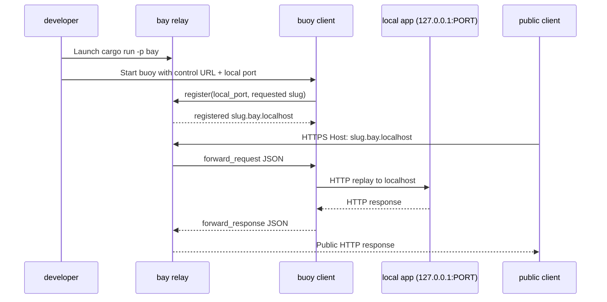

# TunnelBay

TunnelBay lets you share a service running on your laptop (or any machine behind NAT) with someone on the public internet—without fiddling with routers, port forwarding, or manual SSH tunnels. You run a **buoy** next to your app, point it at a publicly reachable **bay**, and immediately get a stable hostname that others can curl or open in their browser. All networking is outbound from the buoy, so even heavily locked-down networks can be published.

Common things you can do with TunnelBay:

- Send QA or product teammates a link to your in-progress feature branch while keeping your dev server private.
- Give webhook providers (Stripe, Slack, GitHub) a URL that forwards back to your local listener so you can iterate quickly.
- Demo a CLI or IoT device that needs to reach your machine, without exposing your entire network or enabling UPnP.

Rust workspace with two binaries:

- `bay`: the relay server. It listens for buoy control connections on `0.0.0.0:7070` (WebSocket `/control`) and serves public HTTP traffic on `0.0.0.0:8080`.
- `buoy`: the client CLI that runs next to your local service, connects out to a bay instance, and proxies requests to a chosen local TCP port.

## Components at a glance

- **Bay (relay)**  
  - Accepts long-lived WebSocket control connections from buoys and keeps them in a slug → tunnel map.  
  - Terminates public HTTP traffic, looks at the `Host` header (`<slug>.<domain>`), and forwards each request to the matching buoy.  
  - Serializes requests/responses as JSON messages so that no inbound ports need to be opened on the machine running the buoy.
- **Buoy (client)**  
  - Runs next to the local service you want to expose and dials the bay’s `/control` WebSocket.  
  - Registers the local TCP port (and optional subdomain), receives an assigned hostname, and keeps a single outbound connection alive.  
  - For each forwarded request it replays the HTTP call against `127.0.0.1:<local_port>`, captures the response, base64-encodes the body, and ships it back to bay.

## Usage

1. Start the bay server (in one terminal):
   ```bash
   cargo run -p bay
   ```

2. Run your local HTTP service on some port (e.g., 3000).

   ```bash
   uv run python -m http.server 3000
   ```

3. Start a buoy that points at that service:
   ```bash
   cargo run -p buoy -- --port 3000 --control-url ws://127.0.0.1:7070/control
   ```
   The buoy prints the public hostname (e.g., `abc123.bay.localhost`). Any HTTP request that hits the bay with `Host: abc123.bay.localhost` will be forwarded to `http://127.0.0.1:3000`.

   Environment variables can replace the flags if you prefer:
   ```
   export TUNNELBAY_CONTROL_URL=wss://bay.apps.timvw.be/control
   export TUNNELBAY_LOCAL_PORT=4000
   export TUNNELBAY_SUBDOMAIN=my-app
   cargo run -p buoy
   ```
   CLI arguments always take precedence over the env vars.

4. Hit the tunnel from another terminal using curl:
   ```bash
   curl -H "Host: abc123.bay.localhost" http://127.0.0.1:8080
   ```
   Replace `abc123` with the slug the buoy printed. You should see the content served by your local HTTP server.

### What happens under the hood

1. You start a buoy beside your local service. It stores the port it needs to hit (for example `3000`) and establishes a single outbound WebSocket to the bay’s `/control` endpoint.
2. Bay acknowledges the connection, hands out a hostname such as `abc123.bay.localhost`, and keeps that slug → buoy mapping in memory. This is the link you share with your testers or webhook providers.
3. When an external client sends an HTTP request to that hostname, bay terminates the TCP/TLS connection, packages the request (method, headers, and body) as JSON, and streams it over the existing WebSocket to the buoy.
4. The buoy replays the request against `http://127.0.0.1:<local_port>`, captures the response, and ferries it back over the WebSocket.
5. Bay unwraps the response, writes it back to the original client, and logs timing information so you can observe tunnel health.

#### Request flow at a glance



From the end-user’s perspective they just load the shared URL; behind the scenes TunnelBay is acting like a programmable reverse proxy that bridges public traffic to your private network without needing any inbound connectivity.

### Building container images

Use the provided Justfile targets (requires Docker Buildx):

```bash
just build-bay   # builds linux/amd64 bay image
just build-buoy  # builds linux/amd64 buoy image
```

The workflow `.github/workflows/release-images.yaml` runs the same builds on tags and publishes to GHCR.

## How bay and buoys work

### Control-plane handshake (WebSocket `/control`)
1. Buoy opens a WebSocket and immediately sends a JSON `register` message with the local port and optional requested subdomain.
2. Bay lowercases the requested slug, verifies that it is available, or generates a random 6-char slug if no slug was supplied or the requested one is taken.
3. Bay stores an in-memory `TunnelHandle` containing the hostname, IP that initiated the control connection, and an `mpsc` sender used to push `forward_request` messages.
4. Bay replies with a `registered` message that includes the hostname (`<slug>.<BAY_DOMAIN>`). The buoy prints it and keeps the socket alive (responding to ping/pong).

### HTTP/data path
1. Public clients hit bay over HTTP/1.1 with `Host: <slug>.<domain>`. Bay parses the slug from the host header and finds the `TunnelHandle`.
2. Bay buffers up to 2 MiB of the request body, base64-encodes it, and creates a `forward_request` JSON message with a unique `request_id`.  
   Requests that cannot be delivered (missing slug, slug offline, body too big, serialization errors) return `4xx/5xx` to the caller immediately.
3. The buoy receives the message, rebuilds an HTTP request toward `http://127.0.0.1:<local_port>`, mirrors the original headers (except `Host`), and streams it via Reqwest.
4. Once the local service responds, buoy captures the status, headers, and body, base64-encodes the body, and sends a `forward_response` back over the WebSocket.
5. Bay matches the response with the original `request_id`, restores the HTTP response, sets `x-forwarded-for` to the buoy’s source IP address, and returns it to the public caller.  
   Bay waits up to 30 seconds for a response before replying with `504 Gateway Timeout`.

### Hostnames, limits, and resilience

- Hostnames are always of the form `<slug>.<BAY_DOMAIN>`. Provide `--subdomain foo`/`TUNNELBAY_SUBDOMAIN=foo` to request a deterministic slug; random slugs are lowercase `[a-z0-9]`.
- Each HTTP body is limited to 2 MiB by `MAX_REQUEST_BYTES`. Tune this constant if you need larger payloads.
- X-Forwarded-For is added on the bay side, sourcing either the `x-forwarded-for` header from the control connection (when bay is behind an ingress) or the TCP peer IP.
- If the WebSocket drops, bay removes the slug; starting the buoy again re-registers and yields a fresh mapping.

TLS termination, auth, and multi-tenant policies are intentionally out of scope for this first cut; you can place bay behind Traefik or another ingress to add HTTPS.

### Configuring bay via environment variables

`bay` accepts these environment variables (defaults in parentheses):

| Variable | Description |
| --- | --- |
| `BAY_DOMAIN` (`bay.localhost`) | Base domain used when advertising hostnames to buoys. For example, use `bay.apps.timvw.be` so public URLs look like `*.bay.apps.timvw.be`. |
| `BAY_HTTP_ADDR` (`0.0.0.0:8080`) | Address the HTTP listener should bind to inside the container. |
| `BAY_CONTROL_ADDR` (`0.0.0.0:7070`) | Address for buoy control connections (plain TCP / WebSocket `/control`). |

Example:

```bash
BAY_DOMAIN=bay.apps.timvw.be \
BAY_HTTP_ADDR=0.0.0.0:8080 \
BAY_CONTROL_ADDR=0.0.0.0:7070 \
bay
```

### Configuring buoy via environment variables

`buoy` accepts equivalent configuration via CLI flags or the following environment variables:

| Variable | Description |
| --- | --- |
| `TUNNELBAY_CONTROL_URL` (`ws://127.0.0.1:7070/control`) | WebSocket URL for the bay control plane. |
| `TUNNELBAY_LOCAL_PORT` (`3000`) | Local TCP port that the buoy forwards traffic to. |
| `TUNNELBAY_SUBDOMAIN` (unset) | Optional requested slug/hostname. Bay falls back to a random slug if unavailable. |
