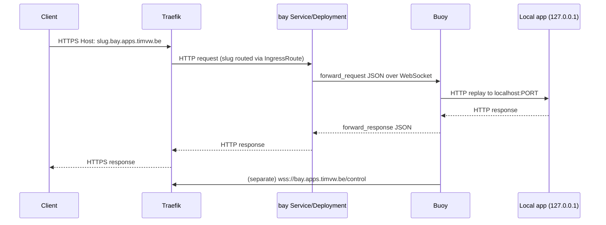

# Kubernetes deployment guide

This guide documents how we run the `bay` relay on a Kubernetes cluster that is managed by Flux CD. The repo keeps the manifests under `docs/k8s/clusters/kubernetes/bay/`, Traefik terminates TLS (with Let’s Encrypt), and DNS is automated either through Flux-managed controllers (external-dns) or via Terraform-managed Route53 records.

## Prerequisites

- Published container images for `bay`/`buoy` (e.g. `ghcr.io/timvw/tunnelbay-bay:v0.7`).
- Optional but recommended: Flux CD (v2) so that Git changes are reconciled automatically. You can also apply the manifests manually with `kubectl apply -k docs/k8s/clusters/kubernetes/bay`.
- Traefik installed in front of the cluster. external-dns is optional—use it only if you want DNS records managed automatically; otherwise keep using the Terraform flow described later.
- Control over the DNS zone that backs `BAY_DOMAIN` (for example `bay.apps.timvw.be`).

## 1. GitOps layout (Flux-friendly)

All manifests for the relay live in `docs/k8s/clusters/kubernetes/bay/` and follow the same structure whether Flux applies them or you run `kubectl apply -k` manually:

```
docs/k8s/clusters/kubernetes/bay/
├── deployment.yaml
├── ingressroute-control-http.yaml
├── ingressroute-control.yaml
├── ingressroute-wildcard-http.yaml
├── ingressroute-wildcard.yaml
├── kustomization.yaml
├── namespace.yaml
└── service.yaml
```

Key files:

- `namespace.yaml` – creates the isolated `bay` namespace and tags it with the Flux tenant label.
- `deployment.yaml` – deploys the relay using the published GHCR image and sets `BAY_DOMAIN`, `BAY_HTTP_ADDR`, and `BAY_CONTROL_ADDR`.
- `service.yaml` – exposes port `8080` for HTTP traffic and `7070` for WebSocket control.
- `ingressroute-*.yaml` – Traefik IngressRoutes that forward wildcard traffic (`*.bay.apps.timvw.be`) and `/control` to the Service, complete with redirect-to-HTTPS middleware.
- `kustomization.yaml` – the entry point that Flux watches. If you are not using Flux you can still apply everything with `kubectl apply -k docs/k8s/clusters/kubernetes/bay`.

## 2. Deploying (Flux or kubectl)

1. Make the required edits (image tag, domain, resource requests) in the manifests above.
2. Commit and push the changes if you are using GitOps:
   ```bash
   git commit -am "deploy: update bay image"
   git push origin docs-k8s-deployment
   ```
3. Ask Flux to reconcile so the cluster picks up the commit immediately:
   ```bash
   flux reconcile source git flux-system --with-source
   flux reconcile kustomization cluster --with-source
   ```
   Replace `cluster` with the name of the Flux `Kustomization` that includes `docs/k8s/clusters/kubernetes`. Flux will apply `docs/k8s/clusters/kubernetes/bay/kustomization.yaml`, creating/updating every manifest inside.

   **Not using Flux?** Run the same manifests manually:
   ```bash
   kubectl apply -k docs/k8s/clusters/kubernetes/bay
   ```
   This applies the namespace, Deployment, Service, and IngressRoutes directly without Flux in the loop.

## 3. Traefik and TLS

Traefik is already installed through Flux, so the repo only needs IngressRoutes:

- `ingressroute-wildcard*.yaml` terminates HTTPS for all slugs (`^[a-z0-9-]+\.bay\.apps\.timvw\.be$`) using the `dnsresolver` certificate resolver. The HTTP variant delegates to the `redirect-to-https` middleware defined in the `traefik` namespace.
- `ingressroute-control*.yaml` routes `https://bay.apps.timvw.be/control` to the control port using the `leresolver` certificates.

The TLS resolvers (`dnsresolver`, `leresolver`) must already exist in the Traefik `HelmRelease`. Adjust the resolver names or domain list if your cluster uses different settings.

### Request flow



This captures both paths: Traefik → bay for public requests and the outbound WebSocket tunnel buoys maintain to service those requests.

## 4. DNS management

You still need wildcard and apex DNS records that point at the Traefik load balancer:

1. `bay.apps.timvw.be` → Traefik load balancer address / alias.
2. `*.bay.apps.timvw.be` → same target (so every slug resolves automatically).

If external-dns is part of the cluster, annotate the IngressRoutes or Services with `external-dns.alpha.kubernetes.io/hostname` so records are created automatically. Otherwise manage DNS through Terraform as described below.

### Using Terraform-managed DNS

1. Edit the Terraform module/file that owns your Route53 zone (for example `modules/domain/be.tf`).
2. Append CNAME/A records that point `bay.apps.timvw.be` and `*.bay.apps.timvw.be` to the Traefik load balancer:
   ```hcl
   cname_records = [
     # existing entries...
     {
       name  = "bay.apps"
       value = "internal-traefik-123456.eu-west-1.elb.amazonaws.com."
       ttl   = 60
     },
     {
       name  = "*.bay.apps"
       value = "internal-traefik-123456.eu-west-1.elb.amazonaws.com."
       ttl   = 60
     }
   ]
   ```
3. From the Terraform stack root run:
   ```bash
   terraform init   # if needed
   terraform plan -target=module.your_zone_records
   terraform apply -target=module.your_zone_records
   ```

Once applied, Route53 serves both the apex and wildcard entries used by the IngressRoutes.

## 5. Operating buoys

Developers run buoys locally, pointing them at the public control endpoint fronted by Traefik:

```bash
export TUNNELBAY_CONTROL_URL=wss://bay.apps.timvw.be/control
export TUNNELBAY_LOCAL_PORT=3000
export TUNNELBAY_SUBDOMAIN=my-demo
cargo run -p buoy
```

You can also schedule buoys inside the cluster by deploying the `buoy` container and pointing `TUNNELBAY_LOCAL_PORT` at a ClusterIP Service.

## 6. Final verification

- Manifests under `docs/k8s/clusters/kubernetes/bay/` reference the correct image and domain.
- Flux successfully reconciles the `kustomization.yaml` in that directory.
- Traefik reports healthy routes for wildcard and control traffic; certificates use the expected resolvers.
- DNS contains both `bay.apps.timvw.be` and `*.bay.apps.timvw.be`, either via external-dns or Terraform.
- Buoys connect to `wss://bay.apps.timvw.be/control` and print valid slugs.

Once these checks pass, links handed out by buoys resolve globally, terminate on Traefik with valid TLS, and reach your local services reliably.
